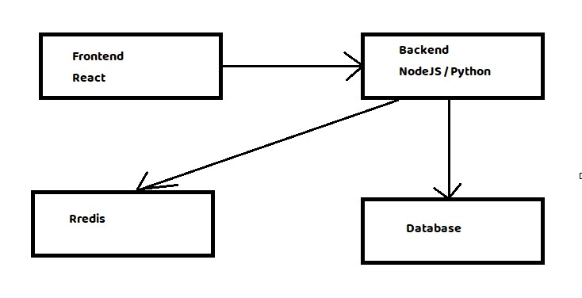

React, NodeJS, Redis and Mysql Microservice:
===

**Objective:**

Architecture diagram on how to launch React, nodeJS, redis and mysql.




**Project build Technology:**
1. React.js ( Frontend )
2. Python / Node.js ( Backend )
3. Redis
4. Database


Prerequisites:
-----------
- Docker
- NodeJS
- Redis
- MySql


Build the container frontend, backend, redis and mysql using docker-compose:

```
  # docker-compose build --no-cache
  # docker-compose up -d
```

Create Database in Mysql:
====
```
mysql> use mysql;
mysql> create database movie;
mysql> use movie;

```
```
mysql> CREATE TABLE mreview (ID int AUTO_INCREMENT PRIMARY KEY, movieName varchar(50), movieReview varchar(100));

mysql> flush privileges;
```
```
mysql> insert into mreview (movieName, movieReview) values ("Hello", "Good");
```
```
mysql> select * from mreview;

+----+-----------+-------------+
| ID | movieName | movieReview |
+----+-----------+-------------+
|  1 | Hello     | Good        |
+----+-----------+-------------+

```
Verify:
---
```
Get Data:
http://192.168.0.9:8000/

Insert Data:
http://192.168.0.9:8000/insert

React UI:
http://192.168.0.9:3000
```

